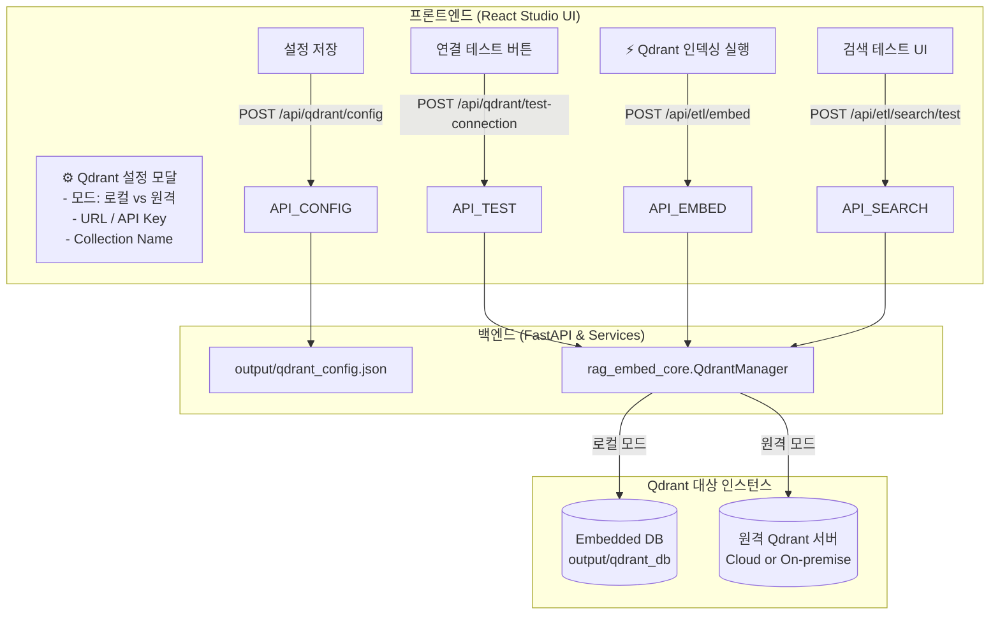

# MinerU RAG ETL Studio: 한국어 하이브리드 임베딩 모듈 분리 및 Qdrant 연동 구현 계획서

> **문서 상태**: Approved / Ready to Execute  
> **최초 작성일**: 2026-09-07  
> **대상 프로젝트**: `mineru_poc` (FastAPI + React Vite)  
> **핵심 과제**: 
> 1. **Index-Query Skew(색인-검색 불일치) 방지**: 인덱싱(ETL) 시점과 런타임 서비스(Query) 시점에 100% 동일한 임베딩 로직 보장
> 2. **독립 라이브러리화 (`packages/rag_embed_core/`)**: 추후 별도 서빙 앱/외부 프로젝트에서 `pip install` 혹은 서브모듈로 즉시 재사용 가능한 모듈 분리
> 3. **Dense & Sparse 사양**:
>    - **Dense**: `dragonkue/BGE-m3-ko` (한국어 특화 BGE-M3 1024차원, Mac Apple Silicon Metal `mps` 가속)
>    - **Sparse**: `Kiwi` + `SHA256 uint32` + `Qdrant Modifier.IDF` (서버사이드 실시간 역문서빈도 자동 반영)
> 4. **유연한 Qdrant 연결 및 프론트엔드 설정 (Front-end Settings UI)**:
>    - **로컬 임베디드 모드** (`output/qdrant_db`) vs **원격 서버 모드** (`http://host:6333` + API Key)
>    - 프론트엔드에서 연결 정보 및 컬렉션 이름을 직접 설정/테스트/저장할 수 있는 모달 UI 제공

---

## 1. Goal Description (목표 및 배경)

### 1.1 배경 및 핵심 문제의식
* RAG 시스템 구축 시 가장 빈번하게 발생하는 치명적인 결함은 **"ETL(인덱싱) 단계에서 토큰화/임베딩한 방식"**과 **"실제 운영 앱(검색 런타임)에서 쿼리를 토큰화/임베딩하는 방식"**이 미세하게 달라져 검색이 실패하는 **Training-Serving Skew (Index-Query Skew)** 현상입니다.
* 특히 **한국어 Sparse 인덱싱**의 경우, Kiwi 형태소 분석기의 품사 필터(`NNG`, `NNP`, `SL`, `SN` 등), 불용어 처리, SHA256 해시 함수(비트 길이, 엔디언), 가중치 계산 공식(Log-TF vs BM25)이 **문서 색인과 쿼리 검색 양쪽에서 100% 비트 단위로 일치**해야 합니다.
* 따라서 `mineru_poc`의 종속적인 내부 코드로 짜지 않고, **독립적으로 배포/재사용 가능한 파이썬 패키지(`packages/rag_embed_core`)로 완전히 모듈화**하여 구현합니다.

### 1.2 Qdrant Modifier.IDF의 핵심 이점
* 기존 전통적인 Sparse 검색(BM25/TF-IDF)은 "전체 코퍼스(Corpus)의 전역 단어 사전과 IDF 통계"를 클라이언트 측에서 미리 계산하거나 동기화해야 하는 큰 기술적 부채가 있었습니다.
* Qdrant의 **`Modifier.IDF`** 기능을 활용하면 이 문제가 완벽히 해결됩니다:
  1. **Stateless 클라이언트**: 클라이언트는 복잡한 전역 통계 없이 문서/쿼리에서 **Kiwi 형태소 추출 후 Term Frequency(TF)와 SHA256 해시 인덱스만 계산**하여 Qdrant에 전달합니다.
  2. **서버사이드 실시간 IDF**: Qdrant 컬렉션 엔진이 인덱스별 Document Frequency($DF$)를 실시간 추적하여, 쿼리 유입 시 자동으로 BM25 규격의 IDF($\ln((N - DF + 0.5)/(DF + 0.5) + 1)$)를 곱해 최종 유사도를 산출합니다.
  3. **네이티브 하이브리드 RRF**: Dense 벡터와 Sparse(Modifier.IDF) 벡터를 Qdrant 내부의 `Prefetch` 및 `Fusion.RRF`를 통해 최적으로 융합합니다.

---

## 2. Architecture & Settings Flow

### 2.1 전체 데이터 및 호출 흐름

```mermaid
graph TD
    subgraph "1. 독립 라이브러리: rag_embed_core"
        A[rag_embed_core]
        A --> B[KiwiSparseEncoder<br/>Kiwi 형태소 + SHA256 uint32 + TF]
        A --> C[DenseEncoder<br/>dragonkue/BGE-m3-ko (1024차원)]
        A --> D[QdrantManager<br/>컬렉션 생성: Modifier.IDF<br/>하이브리드 검색: Fusion.RRF]
    end

    subgraph "2. MinerU RAG ETL Studio (현재 프로젝트)"
        CHUNKS[정제된 자식 청크 ChildChunk] --> B
        CHUNKS --> C
        B & C --> D
        D --> LOCAL_QDRANT[로컬 임베디드 Qdrant DB<br/>output/qdrant_db/]
        D --> JSON_OUT[rag_chunks_embedded.json<br/>JSONL 백업]
        STUDIO_UI[검색 테스트 UI] --> D
    end

    subgraph "3. 외부 프로덕션 서빙 앱 (다운스트림/타 시스템)"
        SERVING_QUERY[사용자 챗봇 쿼리] --> B
        SERVING_QUERY --> C
        B & C --> D
        D --> PROD_QDRANT[운영 Qdrant 클러스터]
    end
```

### 2.2 프론트엔드 설정 및 영속화 흐름



---

## 3. 세부 기술 사양 (Detailed Technical Specifications)

### 3.1 Qdrant 컬렉션 스키마 (`Modifier.IDF` 적용)

```python
from qdrant_client import QdrantClient, models

def create_hybrid_collection(client: QdrantClient, collection_name: str):
    client.create_collection(
        collection_name=collection_name,
        vectors_config={
            "dense": models.VectorParams(
                size=1024, # dragonkue/BGE-m3-ko 출력 차원
                distance=models.Distance.COSINE
            )
        },
        sparse_vectors_config={
            "sparse": models.SparseVectorParams(
                modifier=models.Modifier.IDF # <-- Qdrant 서버사이드 IDF 자동 적용
            )
        }
    )
```

### 3.2 Sparse 인코딩 명세 (Kiwi + SHA256 uint32 + TF)

* **형태소 분석**: `kiwipiepy.Kiwi`
  * 추출 품사: `NNG`(일반명사), `NNP`(고유명사), `NR`(수사), `NP`(대명사), `SL`(외국어), `SN`(숫자), `XR`(어근)
* **결정론적 해시 인덱싱**:
  ```python
  def hash_token_uint32(token: str) -> int:
      # SHA256의 앞 8자리 16진수를 uint32로 변환 (0 ~ 4,294,967,295)
      # Qdrant / Milvus SparseVector 규격 완벽 호환
      return int(hashlib.sha256(token.encode("utf-8")).hexdigest()[:8], 16)
  ```
* **가중치 (Values)**:
  * `Modifier.IDF` 환경에서는 클라이언트가 IDF를 직접 곱하지 않고 단어 빈도(Term Frequency)만 전달:
    * 문서: $TF = 1.0 + \ln(count)$ (Sublinear scaling)
    * 쿼리: $TF = 1.0$ (또는 질의 내 빈도)
* **충돌 방지**: 동일 해시 인덱스로 떨어지는 경우 $\max$ 가중치 취합

### 3.3 Dense 인코딩 명세 (`dragonkue/BGE-m3-ko`)
* **아키텍처**: RoFormer 기반 한국어 파인튜닝 BGE-M3 (1024차원)
* **디바이스 가속**: Mac 환경에서 `torch.backends.mps.is_available()` 감지 시 Metal(MPS) 자동 활성화, 미지원 시 CPU 폴백
* **L2 정규화**: `normalize_embeddings=True`

### 3.4 Qdrant 네이티브 하이브리드 검색 (Fusion.RRF)
```python
results = client.query_points(
    collection_name=collection_name,
    prefetch=[
        models.Prefetch(
            query=models.SparseVector(indices=sparse_q.indices, values=sparse_q.values),
            using="sparse",
            limit=20,
        ),
        models.Prefetch(
            query=dense_q,
            using="dense",
            limit=20,
        )
    ],
    query=models.FusionQuery(
        fusion=models.Fusion.RRF # Reciprocal Rank Fusion
    ),
    limit=top_k
)
```

---

## 4. UI/UX 상세 기획 (Frontend Settings & Playground)

### 4.1 ⚙️ Qdrant 설정 모달 (`QdrantConfigModal.tsx`)
* **접근 경로**: 상단 툴바 우측 `[⚙️ Qdrant 설정]` 버튼
* **주요 구성**:
  1. **실행 모드 토글 (라디오/탭)**:
     - 🖥️ **로컬 내장 모드 (Embedded)**: "추가 서버 설치 없이 `output/qdrant_db` 디렉토리에 로컬 임베디드로 즉시 구동"
     - 🌐 **원격 서버 모드 (Remote Server)**:
       - **Server URL**: 입력 필드 (예: `http://localhost:6333` 또는 `https://xyz.qdrant.tech:6333`)
       - **API Key**: 패스워드 마스킹 입력 필드
       - **[연결 테스트 (Test Connection)] 버튼**: 클릭 시 실시간 헬스체크 및 `✅ 연결 성공 (Qdrant v1.11.2, 컬렉션 4개 감지)` 알림
  2. **컬렉션 설정**:
     - **Collection Name**: 입력 필드 (기본 추천값: `mineru_{filename}`)
     - **기존 컬렉션 재생성 (Recreate)**: 스위치/체크박스 ("체크 시 기존 컬렉션을 삭제하고 새로 생성")
  3. **하단 액션**: `[취소]`, `[설정 저장 (Save Settings)]`

### 4.2 검색 플레이그라운드 (`RetrievalPlayground.tsx`)
* 상단 헤더 탭에 `[문서 청크]`, `[하이브리드 검색 테스트]` 배치
* 질의어 입력창 및 검색 실행:
  * Qdrant RRF 종합 순위표시
  * 매칭된 원문 텍스트, 페이지 번호, 부모 섹션 경로
  * 클릭 시 원본 청크 상세 팝업 표시

---

## 5. 단계별 구현 계획 (Implementation Phases)

### Phase 1: 독립 패키지 구축 (`packages/rag_embed_core/`)
* [ ] `packages/rag_embed_core/pyproject.toml` 생성
* [ ] `rag_embed_core/config.py`: `QdrantConfig` Pydantic 모델
* [ ] `rag_embed_core/models.py`: `SparseVector`, `HybridSearchResult` 모델
* [ ] `rag_embed_core/sparse.py`: `KiwiSparseEncoder` (Kiwi + SHA256 uint32 + TF)
* [ ] `rag_embed_core/dense.py`: `DenseEncoder` (`dragonkue/BGE-m3-ko`, MPS/CPU)
* [ ] `rag_embed_core/qdrant_ops.py`: `QdrantManager` (로컬/원격 클라이언트, Modifier.IDF, Upsert, RRF 검색)
* [ ] `packages/rag_embed_core/tests/`: 단위 테스트 작성 및 통과 검증

### Phase 2: Backend 연동 및 API 확장 (`backend/app/`)
* [ ] 루트 `pyproject.toml`에 `kiwipiepy`, `sentence-transformers`, `qdrant-client` 추가 및 설치
* [ ] `backend/app/services/qdrant_config_svc.py`: Qdrant 설정 파일(`output/qdrant_config.json`) 관리
* [ ] `backend/app/services/embedding_svc.py`: 청크 인코딩 및 Qdrant 업서트/검색 서비스
* [ ] `backend/app/main.py`:
  * `GET/POST /api/qdrant/config` (설정 조회 및 저장)
  * `POST /api/qdrant/test-connection` (연결 테스트)
  * `POST /api/etl/embed` (Qdrant 인덱싱 실행)
  * `GET /api/etl/embed/status` (인덱싱 상태 조회)
  * `POST /api/etl/search/test` (Qdrant RRF 하이브리드 검색)
  * `GET /api/etl/export/vectors` (벡터 포함 JSONL 내보내기)

### Phase 3: Frontend UI 확장 (`frontend/src/`)
* [ ] API 클라이언트 확장 (`frontend/src/api/client.ts`)
* [ ] `QdrantConfigModal.tsx`: Qdrant 로컬/원격 설정 및 연결 테스트 모달
* [ ] `RetrievalPlayground.tsx`: Qdrant 하이브리드 검색 테스트 뷰
* [ ] `Header.tsx` & `ControllerBar.tsx`: 탭 전환, `[⚙️ Qdrant 설정]`, `[⚡ Index to Qdrant]` 버튼 연동

---

## 6. 검증 계획 (Verification Plan)

1. **자동화 테스트**:
   * `pytest packages/rag_embed_core/tests`
   * 토큰화 해시 일관성, BGE-M3-ko 임베딩 차원(1024), Qdrant `:memory:` 모드 `Modifier.IDF` 및 RRF 랭킹 테스트
2. **UI 수동 검증**:
   * Qdrant 설정 모달에서 로컬 모드 연결 테스트 성공 확인
   * PDF 파싱 후 `[⚡ Index to Qdrant]` 실행 시 청크가 Qdrant에 성공적으로 적재되는지 확인
   * `[하이브리드 검색 테스트]` 탭에서 한국어 질의어 검색 후 정밀한 검색 결과 도출 확인
3. **독립 모듈 검증**:
   * 외부 파이썬 스크립트에서 `from rag_embed_core import ...`로 단독 실행하여 스튜디오와 100% 동일한 인덱싱/검색이 이루어지는지 검증
