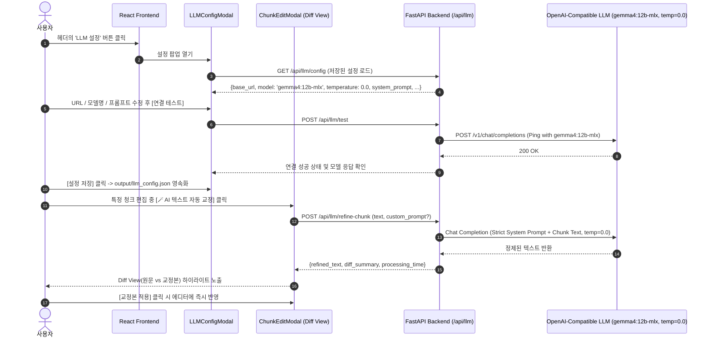

# MinerU RAG - 로컬 LLM 기반 청크 텍스트 자동 교정(띄어쓰기·줄바꿈 정제) 구현 계획서

## 1. 개요 및 배경

### 1.1 배경
- MinerU를 통해 추출된 PDF 청크 본문에는 PDF 고유의 레이아웃 한계로 인해 **비정상적인 줄바꿈(단어 중간 개행, 하이픈 개행)**, **조사 띄어쓰기 결함**, **단어 병합** 등이 잔존하기 쉽습니다.
- 이러한 텍스트 결함은 **형태소 분석기(Kiwi)의 키워드 인식 누락**과 **Dense 임베딩(BGE-M3)의 표현력 저하**로 이어져 검색 및 RAG 생성 품질을 저하시킵니다.

### 1.2 핵심 요구사항 및 목표
- **기본 모델**: **`gemma4:12b-mlx`** (Apple Silicon MLX 최적화 모델)
- **기본 온도(Temperature)**: **`0.0`** (Greedy Decoding을 통해 창의성을 완전히 배제하고 100% 결정론적이고 일관된 텍스트 정제 수행)
- **OpenAI 호환 API 규격**(`/v1/chat/completions`)을 채택하여 Ollama, LM Studio, vLLM, 로컬 런타임뿐만 아니라 원격 OpenAI API까지 유연하게 연결.
- **설정 팝업(LLMConfigModal)**:
  - **Base URL** 설정 (기본값: `http://localhost:11434/v1` 또는 로컬 서버 포트)
  - **Model 이름** 설정 (기본값: **`gemma4:12b-mlx`**, 직접 입력 및 로컬 모델 목록 자동 탐색 지원)
  - **Temperature** 설정 (기본값: **`0.0`**, 필요 시 미세 조정 가능)
  - **API Key** (선택, 로컬은 생략 가능)
  - **System Prompt**를 팝업 내에서 직접 열람·수정하고, 필요시 언제든 기본 권장 프롬프트로 복원할 수 있도록 제공.
  - **연결 테스트(Test Connection)** 기능으로 URL/모델 정상 작동 여부 즉시 검증.
- **청크 본문 교정 UI**:
  - `ChunkEditModal` 및 `ChunkCard`에서 원클릭으로 띄어쓰기/줄바꿈 자동 보정.
  - **Before vs After Diff 비교 뷰**를 제공하여 사용자가 눈으로 차이를 확인하고 안심하고 [적용]할 수 있는 안전장치 제공.

---

## 2. 시스템 아키텍처 및 데이터 흐름



---

## 3. 세부 변경 사항 (Proposed Changes)

### 3.1 백엔드 (Backend Services & APIs)

#### [NEW] `backend/app/services/llm_config_svc.py`
- LLM 설정 모델(`LLMConfig`) 정의 및 영속화 관리 (`output/llm_config.json`).
- 기본 설정값:
  - `base_url`: `"http://localhost:11434/v1"`
  - `model_name`: `"gemma4:12b-mlx"`
  - `temperature`: `0.0` (Greedy Decoding / 결정론적 텍스트 정제)
  - `api_key`: `""`
  - `max_tokens`: `2048`
  - `timeout`: `60`
  - `system_prompt`: RAG 텍스트 정제 전용 기본 프롬프트
- 기본 프롬프트 복원 헬퍼 `get_default_system_prompt()` 제공.

```python
DEFAULT_SYSTEM_PROMPT = """당신은 학술/기술 문서 및 법률/비즈니스 문서의 OCR/텍스트 추출 결과를 원문 훼손 없이 완벽하게 정제하는 교정 전문가입니다.
입력으로 주어지는 청크 텍스트의 가독성과 형태소 분석 품질을 개선하기 위해 아래 규칙을 엄격히 준수하여 교정하십시오.

[교정 규칙]
1. 원문의 모든 내용, 단어, 어휘, 기술 용어, 고유명사, 숫자, 어순을 100% 그대로 보존하십시오. 절대로 내용을 요약, 부연 설명, 해석, 삭제, 추가하지 마십시오.
2. PDF 레이아웃으로 인해 단어 중간이나 문장 중간에서 부자연스럽게 잘린 비정상적인 줄바꿈(하이픈 개행 포함)을 찾아 자연스러운 한 줄 문단으로 병합하십시오.
3. 의미상 문단 구분이 명확한 경우에만 적절한 빈 줄(Paragraph Break)을 유지하십시오.
4. 국립국어원 표준 맞춤법 및 띄어쓰기 규정에 맞추어 비정상적인 띄어쓰기(붙여 쓰인 조사, 띄어 쓰인 복합명사 등)를 교정하십시오.
5. 표(Markdown Table / HTML Table), 코드 블록, 수식(LaTeX), 특수 기호는 서식을 깨뜨리지 말고 원형 그대로 유지하십시오.
6. 출력은 어떠한 인사말, 설명, 마크다운 코드블록 따옴표(``` 등)도 포함하지 말고, 오직 교정된 순수 텍스트만 출력하십시오."""
```

#### [NEW] `backend/app/services/llm_refine_svc.py`
- 비동기 `httpx.AsyncClient` 기반의 경량 OpenAI 호환 API 통신 모듈.
- `temperature=0.0` 설정 전달.
- 주요 메서드:
  - `test_connection(config: LLMConfig) -> Dict[str, Any]`: 엔드포인트 응답 및 모델 헬스체크.
  - `fetch_models(config: LLMConfig) -> List[str]`: `/v1/models` 엔드포인트에서 사용 가능한 모델 리스트 자동 추출.
  - `refine_chunk_text(text: str, custom_prompt: Optional[str] = None, config: Optional[LLMConfig] = None) -> Dict[str, Any]`:
    - 시스템 프롬프트 주입 후 텍스트 교정 실행.
    - 처리 소요 시간, 원본 글자수, 교정본 글자수 메타데이터 반환.

#### [MODIFY] `backend/app/main.py`
- 라우터 엔드포인트 추가:
  - `GET /api/llm/config`: 현재 저장된 LLM 설정 조회
  - `POST /api/llm/config`: LLM 설정 저장
  - `GET /api/llm/config/default-prompt`: 기본 시스템 프롬프트 텍스트 조회
  - `GET /api/llm/models`: 현재 설정된 URL에서 사용 가능한 모델 목록 조회
  - `POST /api/llm/test`: 연결 테스트
  - `POST /api/llm/refine-chunk`: 단일 청크 텍스트 교정

---

### 3.2 프론트엔드 (Frontend Components & UI)

#### [MODIFY] `frontend/src/types/index.ts`
- LLM 설정 및 응답 인터페이스 추가:
  - `LLMConfig`: `base_url`, `model_name`, `api_key`, `temperature`, `max_tokens`, `system_prompt`
  - `LLMTestResponse`: `success`, `message`, `model`, `latency_ms`
  - `LLMRefineResponse`: `original_text`, `refined_text`, `elapsed_seconds`

#### [MODIFY] `frontend/src/api/client.ts`
- 백엔드 LLM API 호출 클라이언트 함수 추가:
  - `getLLMConfig()`, `saveLLMConfig(cfg)`, `getDefaultSystemPrompt()`
  - `getLLMModels(baseUrl, apiKey)`, `testLLMConnection(cfg)`
  - `refineChunkText(text, customPrompt?)`

#### [NEW] `frontend/src/components/LLMConfigModal.tsx`
- **팝업 UI 구성**:
  1. **Base URL 입력창**: 기본값 `http://localhost:11434/v1`
  2. **Model Name 입력 및 선택**:
     - 기본값: **`gemma4:12b-mlx`**
     - 추천 모델 프리셋 칩: `gemma4:12b-mlx`, `qwen2.5:7b`, `exaone3.5:7.8b`, `llama3.1:8b`
     - [모델 목록 가져오기] 버튼 클릭 시 로컬 서버의 `/v1/models` 목록을 감지하여 드롭다운 선택 가능
  3. **Temperature 설정창**:
     - 기본값: **`0.0`** (결정론적 정제를 위해 0.0 권장 안내)
  4. **API Key 입력창**: `password` 타입, 로컬 구동 시 비워두어도 된다는 안내
  5. **System Prompt 설정 텍스트 영역**:
     - 프롬프트를 상세하게 확인/수정할 수 있는 멀티라인 에디터
     - 상단에 **[기본 권장 프롬프트로 복원]** 버튼 제공
  6. **하단 액션 바**:
     - **[연결 테스트]** 버튼: 성공 시 지연시간(ms) 및 초록 뱃지 표시, 실패 시 에러 원인 표시
     - **[저장]** 버튼: 즉시 백엔드 영속화 및 모달 닫기

#### [MODIFY] `frontend/src/components/Header.tsx`
- `Qdrant 설정` 버튼 좌측에 **"LLM 설정"** 버튼 (`Bot` 또는 `Sparkles` 아이콘) 추가.
- 클릭 시 `LLMConfigModal` 오픈.

#### [MODIFY] `frontend/src/components/ChunkEditModal.tsx`
- 청크 본문 탭 상단 툴바에 **"🪄 AI 텍스트 자동 교정"** 버튼 배치.
- 클릭 시 로딩 애니메이션과 함께 백엔드 호출.
- **Diff View 모달 / 분할 비교 UI**:
  - 좌측: 기존 텍스트 (Original)
  - 우측: 교정된 텍스트 (AI Refined - 줄바꿈 및 띄어쓰기 정리됨)
  - [교정본 적용 (Accept)] 클릭 시 에디터 본문에 즉시 채택 & 저장 가능 상태 전환
  - [취소 (Discard)] 시 원본 유지

#### [MODIFY] `frontend/src/components/ChunkCard.tsx`
- 카드 상단 액션 버튼 그룹에 "AI 교정" 퀵 버튼 추가.

#### [MODIFY] `frontend/src/App.tsx`
- `LLMConfigModal` 상태(`isLLMConfigOpen`) 바인딩 및 전역 핸들러 연결.

---

## 4. 검증 계획 (Verification Plan)

### 4.1 백엔드 API 단위 및 통합 검증
1. **설정 영속화 검증**:
   - `GET /api/llm/config` 호출 시 `model_name`이 `gemma4:12b-mlx`, `temperature`가 `0.0`으로 기본 반환되는지 확인.
   - `output/llm_config.json` 파일 생성 및 영속 저장/불러오기 확인.
2. **OpenAI 호환 통신 검증**:
   - 로컬 서버 실행 상태에서 `POST /api/llm/test` 호출하여 정상 응답 검증.
3. **텍스트 교정 품질 검증**:
   - 비정상 줄바꿈 및 띄어쓰기 결함 텍스트 교정 테스트 (`temperature: 0.0`으로 항상 동일한 최적 정제 결과 확인).
   - 표(HTML) 구조 및 특수 기호 훼손 방지 확인.

### 4.2 프론트엔드 UI/UX 수동 검증
1. 헤더에서 [LLM 설정] 팝업 열기 -> 기본 모델이 `gemma4:12b-mlx`, 온도가 `0.0`으로 채워져 있는지 확인 -> [연결 테스트] 및 [저장] 확인.
2. 시스템 프롬프트 수정 후 [기본 권장 프롬프트로 복원] 작동 확인.
3. 청크 에디터에서 [🪄 AI 텍스트 자동 교정] 실행 -> Diff 비교 창에서 변경점 확인 후 [적용] 클릭 -> 저장 및 Qdrant 색인 연동 확인.
